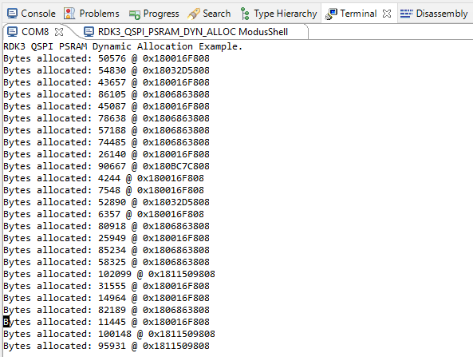
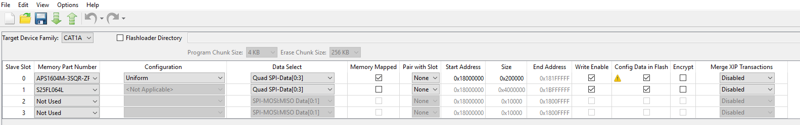
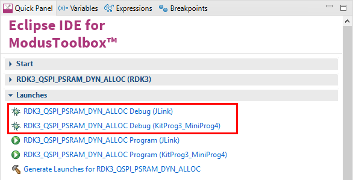

# RDK3 QSPI PSRAM Dynamic Allocation

Rutronik Development Kit 3 Programmable System-on-Chip CYB06447BZI-BLD53 "RDK3 QSPI Dynamic Memory Allocation" Code Example. 

This example demonstrates how to configure and use the PSRAM APS1604M-3SQR-ZR  with standard dynamic memory allocation functions such as malloc() etc.

 

## Requirements

- [ModusToolbox™ software](https://www.cypress.com/products/modustoolbox-software-environment) v3.0

## The Provisioning of the RDK3

The CYB06447BZI-BLD53 device must be provisioned with keys and policies before being programmed. If the kit is already provisioned, copy-paste the keys and policy folder to the application folder. If the unsigned or not properly signed image will be written to the RDK3 PSoC™ 64 – the microcontroller will not boot. 

The “[Secure Policy Configurator](https://www.infineon.com/dgdl/Infineon-ModusToolbox_Secure_Policy_Configurator_1.30_User_Guide-UserManual-v01_00-EN.pdf?fileId=8ac78c8c8386267f0183a960762a5977)” tool is used for the provisioning of the new RDK3, please refer to the “ModusToolbox™ Secure Policy Configurator user guide”. 

The CYB06447BZI-BLD53 MCU must be powered from a 2.5V power source to be able to complete the provisioning. The RDK3 has an SMPS [Switching Mode Power Supply] which can be easily adjusted to provide 3.3V or 2.5V to the MCU by switching the slide-switch “SW1” on the bottom side of the board. 


Please note that the “[Secure Policy Configurator](https://www.infineon.com/dgdl/Infineon-ModusToolbox_Secure_Policy_Configurator_1.30_User_Guide-UserManual-v01_00-EN.pdf?fileId=8ac78c8c8386267f0183a960762a5977) 1.20” requires the KitProg3 to be set into the CMSIS-DAP mode. Please press the “PROG MODE” button on the RDK3 board's front side once. The DEBUG D5 yellow led will flash indicating the CMSIS-MODE activated.


### Using the code example with a ModusToolbox™ IDE:

1. Import the project: **File** > **Import...** > **General** > **Existing Projects into Workspace** > **Next**.
2. Select the directory where **"RDK3_QSPI_DYN_ALLOC"** resides and click  **Finish**.
3. Update the libraries using a **"Library Manager"** tool.
4. Select and build the project **Project ** > **Build Project**.

### Operation

The PSRAM is configured to work in XIP (memory mapped) mode before any dynamic allocation operation can take place. The limited range of random numbers is generated to allocate a variable amount of space in the external memory on every cycle. The allocated memory can be tested additionally by defining the `TEST_ALLOC_MEM`. After the allocation and/or testing is complete the allocated memory is freed. This cycle is infinite in a given example. 

The randomized memory allocation size could be turned off by defining the `ALLOC_FIXED_SIZE` value to the fixed size (up to 8MB). 

The custom **_sbrk()** function needs to be provided for standard memory allocators as malloc() or calloc(). The mentioned function is provided in the example project "sbrk.c" file. Its purpose is to expand the memory to the external PSRAM memory locations defined by `PSRAM_START_ADDR` and `PSRAM_END_ADDR` definition in "sbrk.c" file. 

The results can be seen on the terminal output from the KitProg3 UART and monitoring the user LEDs.



The QSPI interface is configured using the HAL library and the SMIF is configured and initiated using PDL libraries in the function:

```
void Init_SMIF(void)
```

The APS1604M-3SQR-ZR PSRAM memory configuration structures are generated by the "QSPI Configurator":



### Debugging

If you successfully have imported the example, the debug configurations are already prepared to use with a the KitProg3, MiniProg4, or J-link. Open the ModusToolbox™ perspective and find the Quick Panel. Click on the desired debug launch configuration and wait for the programming to complete and the debugging process to start.



## Legal Disclaimer

The evaluation board including the software is for testing purposes only and, because it has limited functions and limited resilience, is not suitable for permanent use under real conditions. If the evaluation board is nevertheless used under real conditions, this is done at one’s responsibility; any liability of Rutronik is insofar excluded. 


